# 操作手册 (v2.2.0)

::: tip 版本说明
本操作手册基于 **v2.2.0** 版本编写。
:::

## ✨ 新功能

### 任务中心与定时调度系统

- **新增任务中心模块**：基于 django-celery-beat 构建动态任务调度系统
- **支持多种调度策略**：一次性、每小时、每天、每周等灵活配置，支持失败重试机制
- **自动化执行能力**：定时触发 UI 自动化批量执行与测试套件执行
- **完整的管理界面**：提供任务管理页面、配置弹窗及执行记录日志查看功能

#### 详细使用步骤

注意：在使用定时任务前提前创建好要执行的用例。

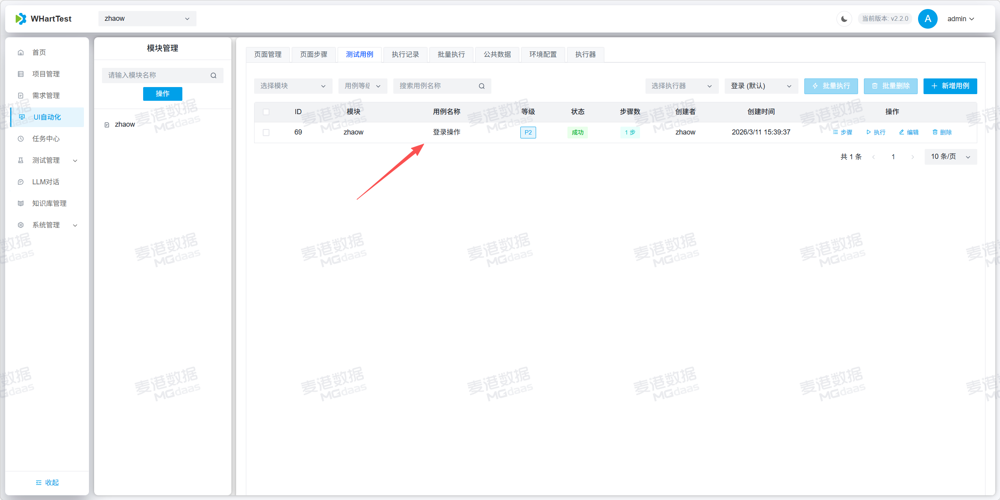

1.创建定时任务

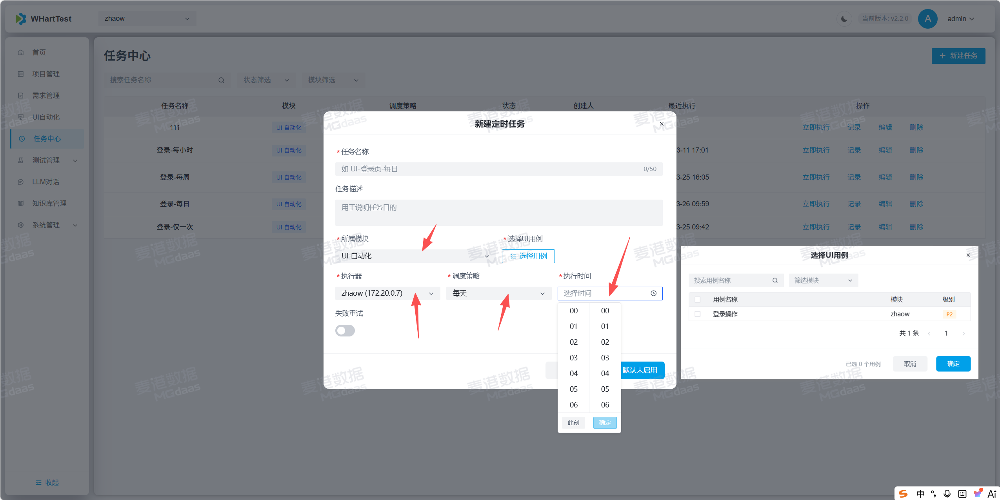

2.定时任务创建完可以选择定时执行和立即执行

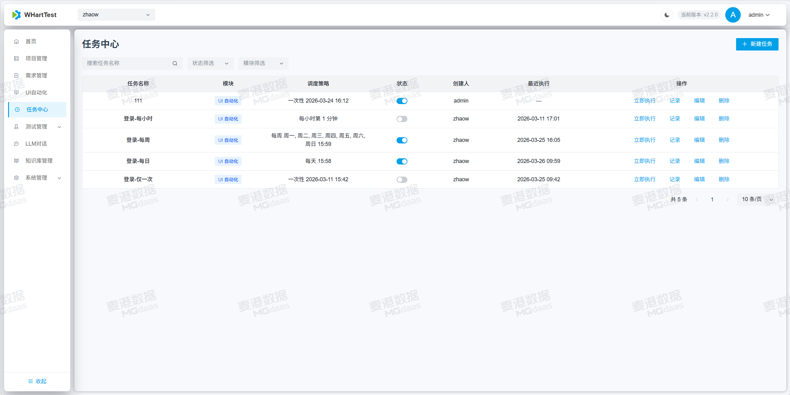

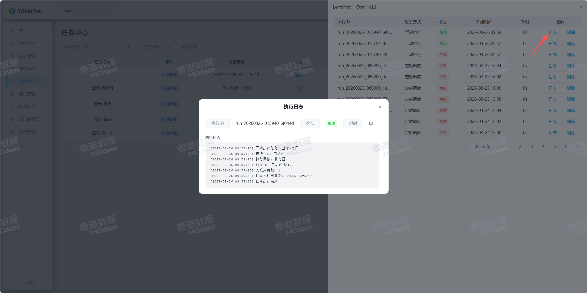

### draw.io 图表生成（skill）
注意！！！：原智能图表功能现已优化为统一加载skill的方式在对话中实现智能图表的生成，使用更加便捷。
- **生成 .drawio 图表文件**：创建原生 draw.io 格式的图表（XML 格式的 mxGraphModel），支持各种图表类型：流程图、架构图、ER图、网络拓扑图、UML图等
- **导出为多种格式**：PNG - 图片格式，支持嵌入 XML（可在 draw.io 中重新编辑）、SVG - 矢量图格式，支持嵌入 XML、PDF - 文档格式，支持嵌入 XML、JPG - 图片格式（不支持嵌入 XML）
- **嵌入可编辑性**：对于 PNG、SVG、PDF 格式，使用 --embed-diagram 参数导出后，文件会包含完整的图表 XML，可以在 draw.io 中打开并继续编辑。

#### 详细使用步骤

注意：在使用前需要在skill管理模块中上传draw.io skill压缩包。

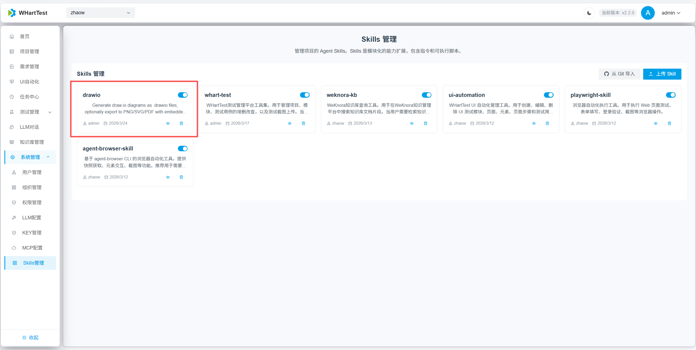

1.使用LLM对话生成图标

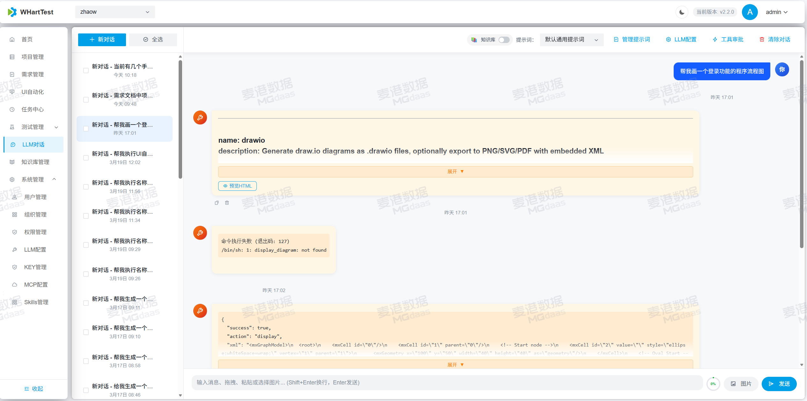

2.生成完可以点击预览或打开新标签去查看

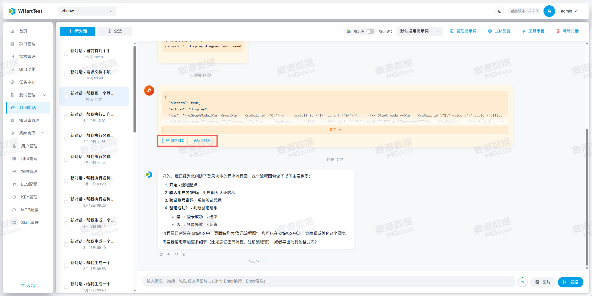
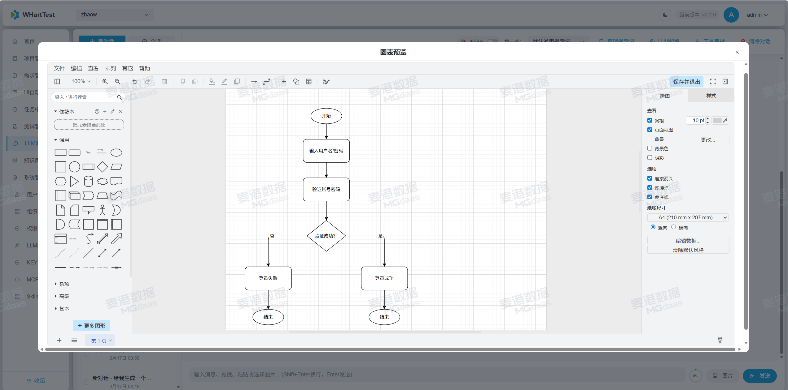

### WeKnora 知识库查询工具（skill）

- **列出知识库**：查询所有可用的知识库，获取 ID、名称、描述等信息。
- **搜索知识库内容**：根据查询文本，在指定知识库中搜索相关的文档片段，返回匹配结果。

#### 详细使用步骤

注意！！！：开始前需要在本地部署好weknora平台，可参考官方文档进行本地部署。

1.创建知识库并配置所需模型

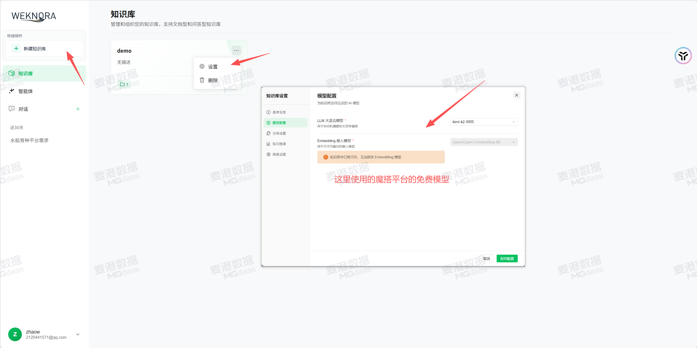

2.点击创建知识库并创建文档

3.获取APIkey

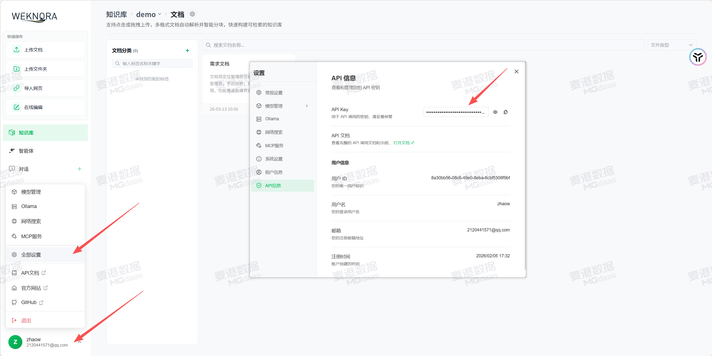

4.替换skill中的URL和KEY

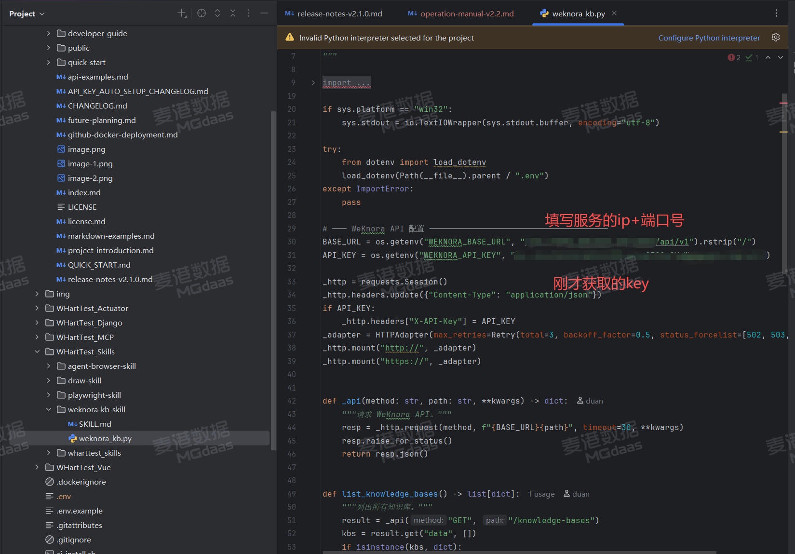

5.在LLM对话中测试刚才上传的文档

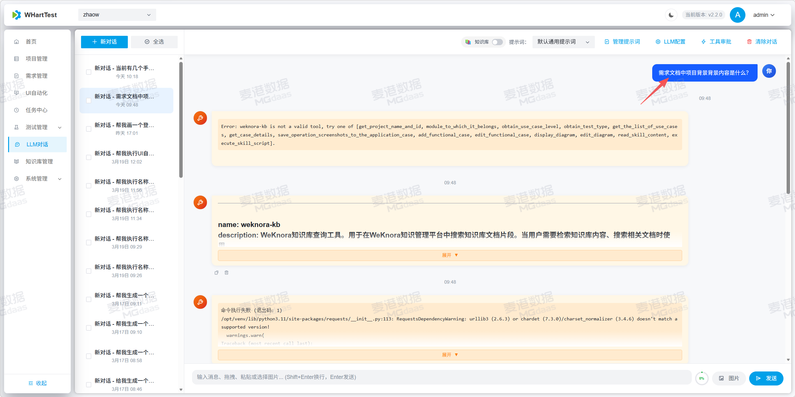

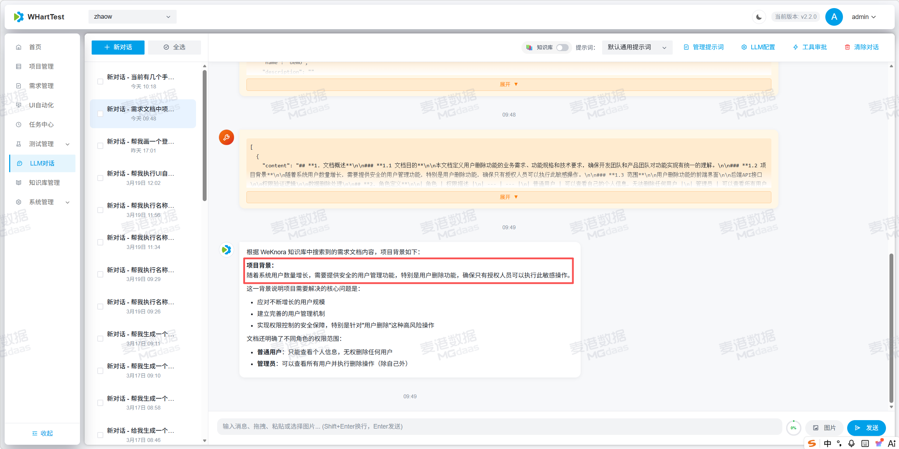

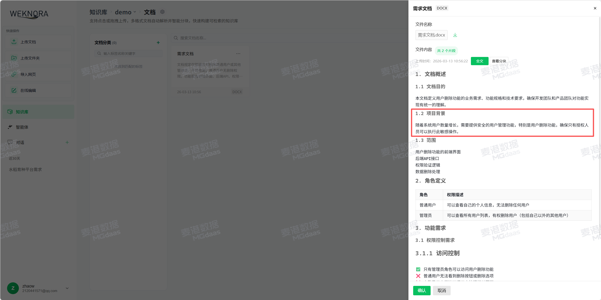

## 🐛 问题修复

### 界面与交互修复

- 修复任务中心展示时间没有进行时区转换的问题
- 修复深色与默认主题的适配问题
- 修复执行器执行用例没有传执行人id的问题
- 修改执行用例时勾选“是否自动生成playwright脚本”为“生成 UI 自动化用例”

## 📦 升级说明

1. **数据库迁移**：升级后请执行数据库迁移：`python manage.py migrate`
2. **依赖安装**：需要重新安装依赖：`pip install -r requirements.txt`
3. 若需启用 `xinference`，请在 compose 文件中手动开启对应服务。
4. **Celery 配置**：任务中心依赖 Celery，需要配置Celery Beat 服务,采用docker部署方式自动部署Celery服务，采用源码部署需要单独启动Celery服务。

Windows源码部署启动Celery Beat 服务方式如下：

开启两个终端窗口分别运行：

uv run celery -A yjtest_django worker --loglevel=info -Q celery,task_center

uv run celery -A yjtest_django beat --loglevel=info

## 🔗 相关资源

- **部署脚本**：使用 `run_compose.sh` 一键构建和启动服务

---